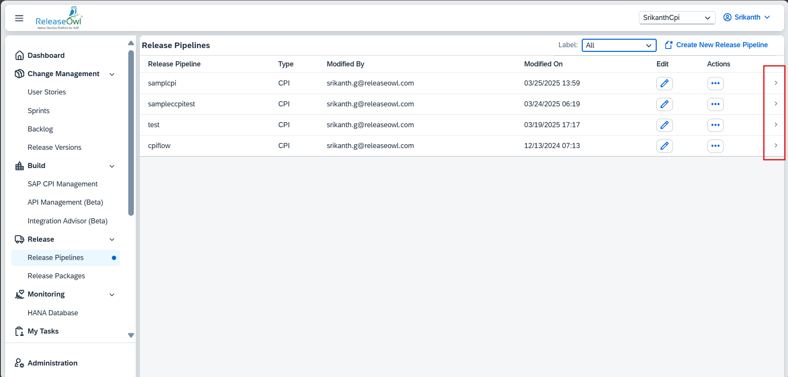

# Improvements

1.  Change Management > User Stories

    1. &#x20;Added a column-level filter (select from menu) for validation status in the User Stories table.
    2. When user story sync is in progress, it should display a message.(Note)

    &#x20;                        &#x20;

    <figure><figcaption></figcaption></figure>

1.  Build > Transport Management

    1. Added a column-level filter (select from menu) for validation status in the Transport Management table.
    2. Verifying deployment permissions before importing via TOC.

    &#x20;      &#x20;

    <figure><figcaption></figcaption></figure>
2. Build > Build Pipeline&#x20;
   1.  Added Created By and Created On columns in the build pipeline table.\

       <figure><figcaption></figcaption></figure>
3. Release > Release Pipeline
   1.  Added a Notify option to notify users in the gCTS switch task(On-Premise).\

       <figure><figcaption></figcaption></figure>
   2. Added a Notify option to notify users in the wait for Promotion Task
   3. Now enabling the viewing of release history for the release pipeline.
4.  Pipeline Activity

    1. Setting TOC log with the SAP TR ID and RO ID for whose TR is imported via TOC. In some cases, there will be only objects in TR without subtasks.
    2. CPI rollback status, to allow the same user story to promote if rollback is completed.&#x20;

    <figure><figcaption></figcaption></figure>

    &#x20; **c**.    Updated deployment mail and modified the user story list data in user story task update
5. My Tasks
   1. Displaying user story attachments in task details.\

   2.  Enhanced navigation to corresponding User Story details, Transport details, and Artifact details(CPI, SAC, SDS).\

       <figure><figcaption></figcaption></figure>
   3. Added a search field to filter "My Tasks" efficiently.
   4. Added a column-level filter (select from menu) for Task Type in the My Tasks table.
   5.  Added a column-level filter (select from menu) for Task Source in the My Tasks table.\

       <figure><figcaption></figcaption></figure>
6. Test Automation
   1. Added validation before creating Test configuration.
7. ALM Integration
   1.  Added the disableComments option in ALM Integration to allow disabling of comments.\

       <figure><figcaption></figcaption></figure>
8. Administration
   1. Added validation before creating RO Agents, Callouts, and the Freeze Period in Administration.
   2. Preventing project creation or switching if the module license has expired.

